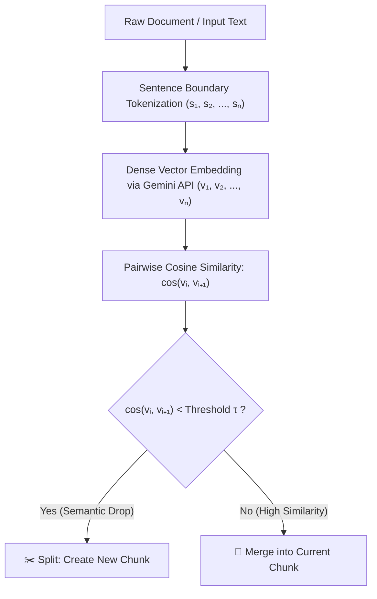

# Module 1: Semantic Chunking vs. Fixed-Size Chunking 🧠

> *Languages:* [English](#-english) | [Español](#-español)

---

## 🇺🇸 English

### 🎯 Objective & Problem Statement
The most common pitfall when building production Retrieval-Augmented Generation (RAG) pipelines is relying on **fixed-size chunking** (e.g., fixed character count or fixed token windows like 500 characters). 

Fixed-size chunking blindly fragments thoughts across arbitrary cutoffs, splitting cohesive concepts across boundaries and diluting the semantic fidelity of dense vector embeddings.

**Semantic Chunking** solves this by evaluating semantic transitions between consecutive sentences using embedding distance metrics (cosine similarity) and only splitting text into a new chunk when a real topical shift is detected.

---

### 🔬 Mathematical & Theoretical Foundations



#### 1. Sentence Tokenization
The input text is split into distinct sentence units using regular expression lookbehinds on terminal punctuation marks (`.`, `?`, `!`):
$$\text{Sentences} = [s_1, s_2, \dots, s_n]$$

#### 2. Dense Vector Embeddings
Each sentence $s_i$ is mapped to a dense embedding vector $\vec{v}_i \in \mathbb{R}^d$ using Google Gemini's embedding model (`gemini-embedding-001`):
$$\vec{v}_i = \text{Embed}(s_i)$$

#### 3. Pairwise Cosine Similarity
For every pair of adjacent sentences $(s_i, s_{i+1})$, the directional cosine similarity is computed:
$$\text{CosineSimilarity}(\vec{v}_i, \vec{v}_{i+1}) = \frac{\vec{v}_i \cdot \vec{v}_{i+1}}{\|\vec{v}_i\| \|\vec{v}_{i+1}\|}$$

#### 4. Thresholding & Boundary Detection
- **Merge condition**: If $\text{CosineSimilarity}(\vec{v}_i, \vec{v}_{i+1}) \ge \tau$, both sentences share strong thematic continuity and are preserved within the same chunk.
- **Split condition**: If $\text{CosineSimilarity}(\vec{v}_i, \vec{v}_{i+1}) < \tau$, a semantic discontinuity is detected, concluding the current chunk and initializing a new one with $s_{i+1}$.

---

### 🚀 Running the Module

#### 1. Environment Setup
Make sure your `.env` contains your Gemini API key:
```env
GEMINI_API_KEY="your-gemini-api-key"
```

#### 2. Run Test Suite
```bash
npm run test:01
```

---

## 🇪🇸 Español

### 🎯 Objetivo y Planteamiento del Problema
El error más común al construir aplicaciones de IA con **RAG (Retrieval-Augmented Generation)** es utilizar la división por tamaño fijo (*fixed-size chunking*, ej. cortes rígidos de 500 caracteres o tokens).

Este enfoque arbitrario fragmenta ideas a mitad de una explicación, dispersa conceptos cohesionados entre múltiples fragmentos y diluye la calidad de los vectores densos.

El **Semantic Chunking** resuelve esta deficiencia analizando la distancia semántica entre oraciones consecutivas mediante embeddings y aplicando un corte únicamente cuando detecta un cambio de tópico real.

---

### 🔬 Fundamentos Teóricos y Matemáticos

#### 1. Segmentación en Oraciones
El texto fuente se divide en oraciones utilizando expresiones regulares con *lookbehinds* sobre signos de puntuación (`.`, `?`, `!`):
$$\text{Oraciones} = [s_1, s_2, \dots, s_n]$$

#### 2. Generación de Embeddings Densos
Cada oración $s_i$ es transformada en un vector denso $\vec{v}_i \in \mathbb{R}^d$ utilizando el modelo de embeddings de Gemini (`gemini-embedding-001`):
$$\vec{v}_i = \text{Embed}(s_i)$$

#### 3. Similitud de Coseno
Para cada par de oraciones adyacentes $(s_i, s_{i+1})$, calculamos su similitud direccional:
$$\text{SimilitudCoseno}(\vec{v}_i, \vec{v}_{i+1}) = \frac{\vec{v}_i \cdot \vec{v}_{i+1}}{\|\vec{v}_i\| \|\vec{v}_{i+1}\|}$$

#### 4. Segmentación por Umbral ($\tau$)
- **Mantener en el chunk**: Si $\text{SimilitudCoseno}(\vec{v}_i, \vec{v}_{i+1}) \ge \tau$, ambas oraciones comparten el mismo contexto temático.
- **Corte temático**: Si $\text{SimilitudCoseno}(\vec{v}_i, \vec{v}_{i+1}) < \tau$, se identifica una transición de tema, cerrando el chunk actual y comenzando uno nuevo a partir de $s_{i+1}$.

---

### 🚀 Cómo Ejecutar

#### 1. Variables de Entorno
Verifica que el archivo `.env` contenga tu API Key de Gemini:
```env
GEMINI_API_KEY="tu-api-key"
```

#### 2. Ejecutar la Prueba
```bash
npm run test:01
```
