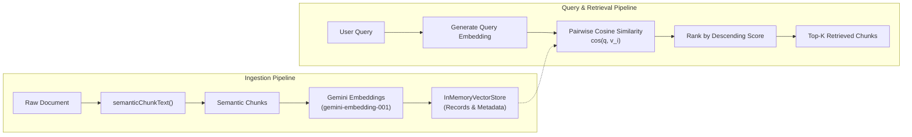

# Module 2: In-Memory Vector Store & Dense Semantic Retrieval 🗄️

> *Languages:* [English](#-english) | [Español](#-español)

---

## 🇺🇸 English

### 🎯 Overview
In Module 1, we implemented **Semantic Chunking** to break long documents into topical segments. In this module, we build an **In-Memory Vector Store** (`InMemoryVectorStore`) that indexes these chunks into dense vector representations and retrieves the most relevant content given user queries using **Cosine Similarity Ranking**.

### 🔬 Architecture & Workflow



### 📐 Mathematical Foundation

#### 1. Dense Representation
Given $N$ semantic chunks, each chunk $c_i$ is embedded into a $d$-dimensional normalized vector space:
$$\vec{v}_i = \text{Embed}(c_i) \in \mathbb{R}^d$$

#### 2. Query Embedding
When a user asks a question $q$, it is mapped to the same embedding space:
$$\vec{q} = \text{Embed}(q) \in \mathbb{R}^d$$

#### 3. Cosine Similarity Scoring & Ranking
The relevance score $S(q, c_i)$ is computed as the cosine of the angle between query and document vectors:
$$S(q, c_i) = \frac{\vec{q} \cdot \vec{v}_i}{\|\vec{q}\|_2 \|\vec{v}_i\|_2} = \frac{\sum_{j=1}^d q_j \cdot v_{i,j}}{\sqrt{\sum_{j=1}^d q_j^2} \sqrt{\sum_{j=1}^d v_{i,j}^2}}$$

The top-$K$ most relevant records are retrieved:
$$\text{TopK}(q) = \arg\max_{c_i \in C}^{(K)} S(q, c_i)$$

### 🚀 How to Run

```bash
npm run test:02
```

---

## 🇪🇸 Español

### 🎯 Descripción General
En el Módulo 1 implementamos **Semantic Chunking** para segmentar documentos en función de sus cambios temáticos. En este módulo construimos un **Vector Store en Memoria** (`InMemoryVectorStore`) que indexa estos chunks en representaciones vectoriales densas y recupera los fragmentos más relevantes ante consultas del usuario mediante **Ranking por Similitud de Coseno**.

### 🔬 Arquitectura y Flujo de Trabajo

1. **Ingestión Semántica**: La salida de `semanticChunkText()` alimenta directamente el método `store.addDocuments()`.
2. **Generación de Embeddings**: Cada chunk y la consulta del usuario se transforman en vectores de alta dimensionalidad utilizando el modelo `gemini-embedding-001`.
3. **Recuperación Densa**: Se calcula la similitud de coseno contra todos los registros indexados y se devuelven los $K$ resultados con mayor puntuación.

### 📐 Fundamentos Matemáticos

- **Espacio Vectorial**: Tanto los chunks como la consulta se proyectan en $\mathbb{R}^d$.
- **Similitud de Coseno**:
$$S(q, c_i) = \frac{\vec{q} \cdot \vec{v}_i}{\|\vec{q}\|_2 \|\vec{v}_i\|_2}$$
- **Invarianza de Longitud**: Al normalizar por las normas euclidianas, la métrica evalúa la orientación semántica sin verse sesgada por la longitud del texto.

### 🚀 Cómo Ejecutar

```bash
npm run test:02
```
