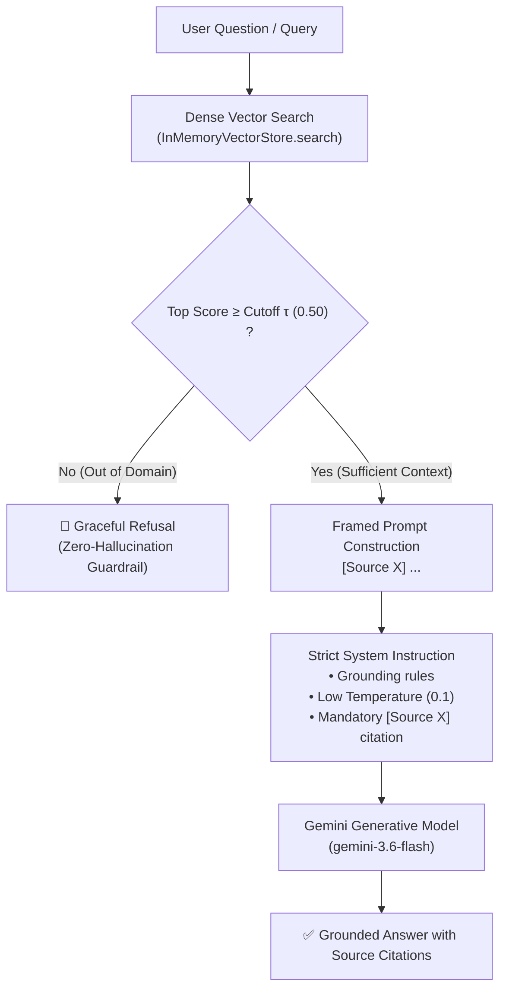

# Module 3: Grounded End-to-End RAG Pipeline with Hallucination Guardrails 🛡️

> *Languages:* [English](#-english) | [Español](#-español)

---

## 🇺🇸 English

### 🎯 Overview & Architecture
Building a production-ready **Retrieval-Augmented Generation (RAG)** pipeline requires far more than just passing retrieved chunks to an LLM. It requires **strict grounding, structured prompt framing, contextual delimiters, and multi-layered hallucination guardrails**.



### 🛡️ Grounding & Anti-Hallucination Mechanisms

1. **Pre-Generation Similarity Cutoff Gate**:
   - Before invoking the generative LLM, the pipeline checks the cosine similarity score of the top retrieved chunk.
   - If $\max_i S(q, c_i) < \tau_{\text{cutoff}}$ (e.g., $0.50$), the system short-circuits and refuses immediately without expending LLM tokens or risking ungrounded generation.

2. **Context Framing & Delimitation**:
   - Context is injected within unambiguous XML delimiters (`<context>...</context>`), completely separating context payload from instructions to prevent prompt injection.

3. **Strict Attribution & Low Temperature**:
   - Model temperature is set to `0.1` to enforce deterministic, low-variance completions.
   - Grounding rules require citing `[Source X]` for all stated facts and refusing extrapolation when facts are absent.

### 🚀 How to Run

```bash
npm run test:03
```

---

## 🇪🇸 Español

### 🎯 Descripción General y Arquitectura
Construir un pipeline de **Generación Aumentada por Recuperación (RAG)** para producción requiere mucho más que simplemente concatenar fragmentos recuperados a un LLM. Exige **anclaje estricto (grounding), delimitación de contexto y barreras de contención contra alucinaciones**.

### 🛡️ Mecanismos de Anclaje y Protección contra Alucinaciones

1. **Filtro Pre-Generación por Umbral de Similitud**:
   - Antes de llamar al modelo generativo, el pipeline evalúa la similitud de coseno del chunk con mayor score.
   - Si $\max_i S(q, c_i) < 0.50$, la consulta se rechaza preventivamente sin generar costos innecesarios ni arriesgar alucinaciones sobre información no verificada.

2. **Delimitación Explícita de Contexto**:
   - Los fragmentos recuperados se encapsulan dentro de etiquetas `<context>...</context>`, previniendo inyecciones de prompt y delimitando la frontera de conocimiento.

3. **Citas Obligatorias y Baja Temperatura**:
   - Temperatura configurada en `0.1` para máxima reproducibilidad y rigor factual.
   - Obliga al modelo a citar explícitamente `[Fuente X]` para respaldar cada afirmación.

### 🚀 Cómo Ejecutar

```bash
npm run test:03
```
