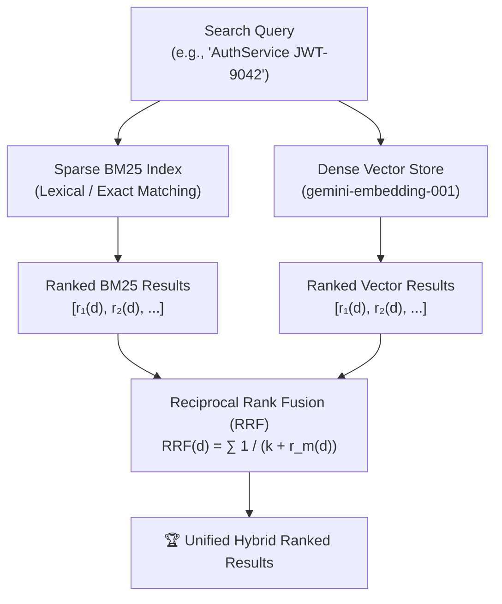

# Module 4: Hybrid Search with BM25 & Reciprocal Rank Fusion (RRF) 🔀

> *Languages:* [English](#-english) | [Español](#-español)

---

## 🇺🇸 English

### 🎯 Overview & Problem Statement
In production RAG systems, **dense vector embeddings** excel at capturing high-level semantic meaning and conceptual similarity. However, dense retrieval suffers from significant blind spots:
- **Exact Identifier Lookups**: SKU numbers, UUIDs, function names (`AuthService`), error codes, and API keys often produce poor vector matches.
- **Out-of-Vocabulary (OOV) Tokens**: Specialized jargon and code tokens dilute vector projections.
- **Short Technical Queries**: Keyword queries like `"JWT-9042"` lack semantic prose for embeddings to distinguish context.

**Hybrid Search** resolves this by fusing **Sparse Lexical Search (BM25)** and **Dense Semantic Search (Vector Embeddings)** into a single unified ranking using **Reciprocal Rank Fusion (RRF)**.

---

### 🔬 Architecture & Workflow



---

### 📐 Mathematical Foundations

#### 1. Okapi BM25 (Sparse Lexical Search)
BM25 scores document $D$ for query $Q = \{q_1, q_2, \dots, q_n\}$ by combining term frequency with document length normalization:

$$\text{score}(D, Q) = \sum_{i=1}^n \text{IDF}(q_i) \cdot \frac{f(q_i, D) \cdot (k_1 + 1)}{f(q_i, D) + k_1 \cdot \left(1 - b + b \cdot \frac{|D|}{\text{avgdl}}\right)}$$

Where:
- $\text{IDF}(q_i) = \ln\left( \frac{N - n(q_i) + 0.5}{n(q_i) + 0.5} + 1 \right)$
- $f(q_i, D)$ is the raw term frequency in document $D$.
- $|D|$ is the length of document $D$ in tokens, and $\text{avgdl}$ is the average document length across the corpus.
- $k_1 = 1.5$ regulates term frequency saturation.
- $b = 0.75$ controls document length normalization penalty.

#### 2. Reciprocal Rank Fusion (RRF)
RRF combines disparate ranking scores (which often have incompatible probability distributions or magnitude scales) based solely on their **ordinal positions**:

$$RRF(d) = \sum_{m \in M} \frac{1}{k + r_m(d)}$$

Where:
- $M = \{\text{BM25}, \text{DenseVector}\}$ is the set of search rankers.
- $r_m(d)$ is the 1-based rank of document $d$ within ranker $m$.
- $k = 60$ is the standard smoothing constant (prevents top-ranked items from excessively dominating the score).

---

### 🚀 How to Run

```bash
npm run test:04
```

---

## 🇪🇸 Español

### 🎯 Descripción General y Planteamiento del Problema
En sistemas RAG en producción, los **embeddings de vectores densos** destacan capturando significado conceptual y similitud semántica. Sin embargo, presentan puntos ciegos críticos:
- **Búsqueda de Identificadores Exactos**: Números de parte (SKUs), UUIDs, nombres de funciones (`AuthService`), códigos de error y claves técnicas a menudo no coinciden bien en espacios latentes densos.
- **Tokens Fuera del Vocabulario (OOV)**: Términos técnicos muy especializados pierden precisión al promediarse en vectores.
- **Consultas Técnicas Breves**: Consultas como `"JWT-9042"` carecen de contexto lingüístico para proyectarse adecuadamente.

La **Búsqueda Híbrida** resuelve esto fusionando **Búsqueda Léxica Dispersa (BM25)** con **Búsqueda Semántica Densa (Embeddings)** mediante **Reciprocal Rank Fusion (RRF)**.

---

### 📐 Fundamentos Matemáticos

#### 1. Algoritmo Okapi BM25
$$\text{score}(D, Q) = \sum_{i=1}^n \text{IDF}(q_i) \cdot \frac{f(q_i, D) \cdot (k_1 + 1)}{f(q_i, D) + k_1 \cdot \left(1 - b + b \cdot \frac{|D|}{\text{avgdl}}\right)}$$

#### 2. Fusión por Rangos Recíprocos (RRF)
$$RRF(d) = \sum_{m \in M} \frac{1}{k + r_m(d)}$$

Donde:
- $M = \{\text{BM25}, \text{Vector}\}$: Conjunto de motores de búsqueda.
- $r_m(d)$: Posición ordinal (1-indexed) del documento $d$ en el motor $m$.
- $k = 60$: Constante de suavizado que equilibra el impacto entre los primeros puestos.

---

### 🚀 Cómo Ejecutar

```bash
npm run test:04
```
