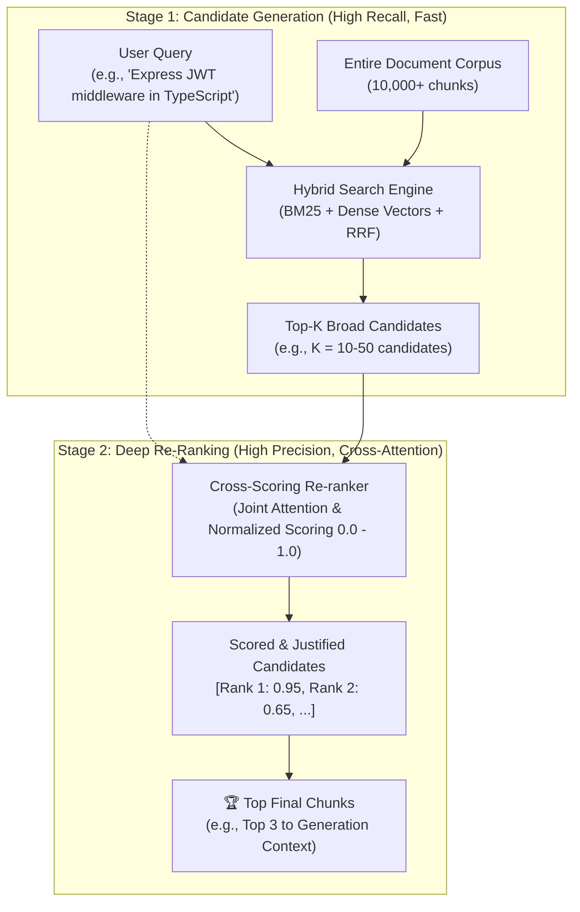

# Module 5: Two-Stage Retrieval Pipeline & Cross-Scoring Re-ranker 🎯

> *Languages:* [English](#-english) | [Español](#-español)

---

## 🇺🇸 English

### 🎯 Overview & Problem Statement
In large-scale production RAG architectures, retrieving relevant knowledge faces a fundamental tension between **computational throughput** and **relevance precision**:

1. **Bi-Encoders (First-Stage Retrieval)**:
   - Queries and documents are mapped into vector embeddings independently: $\vec{v}_q = f(q)$, $\vec{v}_d = g(d)$.
   - Similarity is computed via fast dot products / cosine distance: $S(q, d) = \vec{v}_q \cdot \vec{v}_d$.
   - **Advantage**: Scales to millions of documents ($O(N \cdot D)$ or sub-linear with HNSW/IVF).
   - **Limitation**: Suffers from the "representation bottleneck"—no cross-token attention between query terms and document terms occurs during inference.

2. **Cross-Encoders / Re-rankers (Second-Stage Scoring)**:
   - The query and candidate document are concatenated and fed jointly through full Transformer self-attention layers: $\text{Score}(q, d) = \text{Model}([q; \text{SEP}; d])$.
   - **Advantage**: Every token in the query attends to every token in the candidate chunk, detecting subtle syntactic nuances, exact tech-stack constraints, and negative context.
   - **Limitation**: Computationally prohibitive to run across an entire million-document corpus ($O(N \cdot L^2)$).

**Two-Stage Retrieval** resolves this by pairing **fast broad candidate generation** (Stage 1) with **deep cross-attention re-ranking** (Stage 2).

---

### 🔬 Architecture & Workflow



---

### 📊 Comparative Analysis: Bi-Encoders vs. Cross-Encoders

| Metric / Dimension | Bi-Encoder (Stage 1) | Cross-Encoder (Stage 2 / Re-ranker) |
|---|---|---|
| **Input Structure** | Independent: $E(q)$ and $E(d)$ | Joint Concatenation: $E([q; d])$ |
| **Attention Mechanism** | Intra-sequence only (query tokens never interact with document tokens) | Full Bi-directional Cross-Attention across all $(q, d)$ token pairs |
| **Search Latency** | Sub-millisecond ($< 5\text{ ms}$) via vector index | Tens of milliseconds ($10 - 50\text{ ms}$) per batch |
| **Corpus Scalability** | Millions of records ($10^6 - 10^9$) | Tens to hundreds of candidate chunks ($10 - 100$) |
| **Precision on Constraints** | Moderate (prone to false positives sharing vocabulary or topic) | Extremely High (filters mismatched frameworks, false synonyms, subtle nuances) |

---

### 🚀 How to Run

```bash
npm run test:05
```

---

## 🇪🇸 Español

### 🎯 Descripción General y Planteamiento del Problema
En arquitecturas RAG para producción a gran escala, la recuperación enfrenta un dilema fundamental entre **velocidad de procesamiento** y **precisión semántica**:

1. **Bi-Encoders (Primera Etapa - Generación de Candidatos)**:
   - Codifican la consulta y el documento de forma independiente: $\vec{v}_q = f(q)$, $\vec{v}_d = g(d)$.
   - Calculan la similitud mediante producto punto o similitud de coseno.
   - **Ventaja**: Escalabilidad masiva para buscar entre millones de documentos en milisegundos.
   - **Desventaja**: Cuello de botella de representación (no existe interacción token a token entre consulta y documento).

2. **Cross-Encoders / Re-rankers (Segunda Etapa - Reordenamiento Profundo)**:
   - Evalúan la consulta y el candidato concatenados de forma conjunta dentro de capas de atención completa (*Self-Attention*).
   - **Ventaja**: Máxima fidelidad y precisión para capturar restricciones técnicas exactas (ej. distinguir TypeScript + Express vs Python + FastAPI).
   - **Desventaja**: Costo computacional elevado que impide evaluarlo sobre todo el corpus.

El patrón **Two-Stage Retrieval** combina lo mejor de ambos mundos:
$$\text{Corpus Masivo} \xrightarrow[\text{Rápido y Amplio}]{\text{Stage 1 (Híbrido)}} \text{Top-K Candidatos} \xrightarrow[\text{Atención Cruzada Profunda}]{\text{Stage 2 (Re-ranker)}} \text{Top Chunks Finales}$$

---

### 🚀 Cómo Ejecutar

```bash
npm run test:05
```
