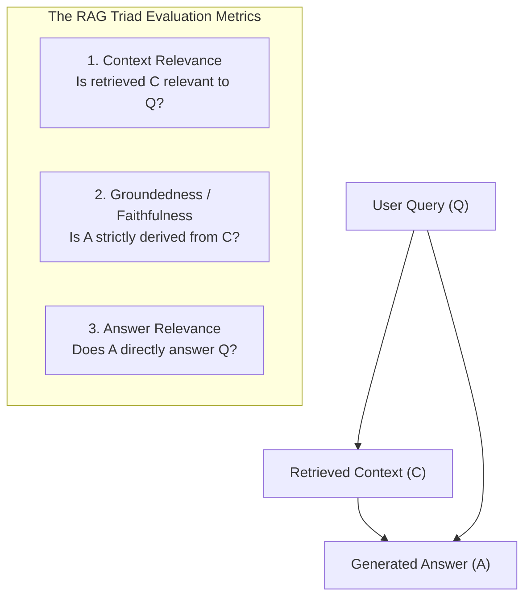

# Module 6: Automated Evaluation, LLM-as-a-Judge & The RAG Triad ⚖️

> *Languages:* [English](#-english) | [Español](#-español)

---

## 🇺🇸 English

### 🎯 Overview & Problem Statement
Deploying RAG pipelines to mission-critical production environments requires rigorous, automated, and continuous evaluation. Human annotation does not scale, while traditional lexical metrics (BLEU, ROUGE) fail because they measure n-gram overlap rather than semantic correctness or factual integrity.

The modern industry standard is **LLM-as-a-Judge** evaluating **The RAG Triad** using structured, deterministic JSON schemas and calibrated guardrail thresholds.

---

### 🔺 The RAG Triad



#### 1. Context Relevance ($Q \rightarrow C$)
Measures whether the retrieval pipeline fetched high-signal chunks without polluting the prompt window with noise or irrelevant context.

#### 2. Groundedness / Faithfulness ($C \rightarrow A$)
Evaluates whether every factual claim in the model's generated answer is **strictly and exclusively** supported by the retrieved context chunks:
$$\text{Faithfulness} = \frac{|\text{Verified Factual Claims Supported by } C|}{|\text{Total Claims Made in } A|}$$
- Score $1.0$: Zero hallucinations; $100\%$ factual grounding.
- Score $< 0.85$: Trigger for production guardrail intervention (blocks or regenerates response).

#### 3. Answer Relevance ($Q \rightarrow A$)
Measures whether the response directly addresses the user's core intent without evasion, hesitation, or unnecessary tangential filler.

---

### 🛡️ Production Guardrail Thresholds

| Metric | Target Production Threshold | Action on Failure |
|---|---|---|
| **Faithfulness** | $\ge 0.85$ (Critical) | Block response / Output verified fallback |
| **Answer Relevance** | $\ge 0.80$ (High) | Route to query expansion or clarify |

---

### 🚀 How to Run

```bash
npm run test:06
```

---

## 🇪🇸 Español

### 🎯 Descripción General y Planteamiento del Problema
Desplegar pipelines RAG en producción exige evaluación continua, cuantitativa y automatizada. La revisión manual no escala y las métricas léxicas tradicionales (como BLEU o ROUGE) fallan porque solo comparan coincidencias superficiales de palabras en lugar de fidelidad factual o relevancia semántica.

El estándar actual de la industria es el patrón **LLM-as-a-Judge** evaluando la **Tríada RAG** mediante esquemas estructurados en JSON y umbrales de guardrails calibrados.

---

### 🔺 La Tríada RAG

1. **Relevancia del Contexto ($Q \rightarrow C$)**: Mide si los fragmentos recuperados son pertinentes para responder la consulta sin introducir ruido.
2. **Fidelidad / Anclaje (*Faithfulness*) ($C \rightarrow A$)**: Verifica que cada afirmación en la respuesta generada esté **estrictamente sustentada en el contexto**, detectando alucinaciones o conocimiento externo no autorizado:
   $$\text{Faithfulness} = \frac{\text{Afirmaciones sustentadas en } C}{\text{Total de afirmaciones en } A}$$
3. **Relevancia de la Respuesta ($Q \rightarrow A$)**: Evalúa si la respuesta resuelve directamente la pregunta del usuario sin divagar.

---

### 🛡️ Umbrales de Guardrails en Producción

- **Faithfulness $\ge 0.85$**: Si el score es inferior, la respuesta contiene alucinaciones y se bloquea preventivamente.
- **Answer Relevance $\ge 0.80$**: Garantiza respuestas directas y útiles.

---

### 🚀 Cómo Ejecutar

```bash
npm run test:06
```
