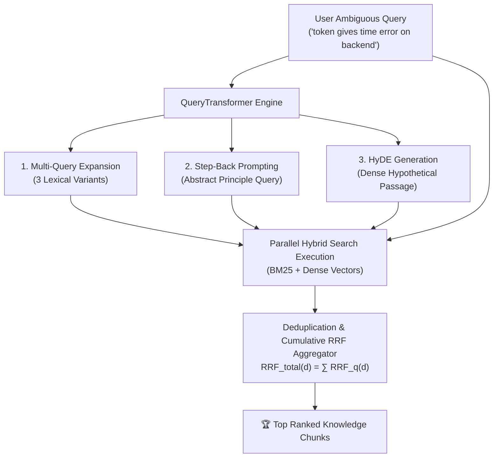

# Module 8: Query Transformation Pipelines (Multi-Query, Step-Back & HyDE) 🔄

> *Languages:* [English](#-english) | [Español](#-español)

---

## 🇺🇸 English

### 🎯 Overview & Problem Statement
In production RAG systems, user queries are frequently **ambiguous, fragmented, vocabulary-mismatched, or underspecified** (e.g., *"token gives time error on backend"*).

Relying on a single raw user query leads to low retrieval recall and precision. **Query Transformation Pipelines** address this by expanding the query into multiple high-signal representations across 3 complementary paradigms:

1. **Multi-Query Expansion**: Generates diverse lexical and technical reformulations to bridge vocabulary mismatch and synonym gaps.
2. **Step-Back Prompting**: Formulates a higher-level, abstract question targeting fundamental theoretical principles and architecture concepts.
3. **Hypothetical Document Embeddings (HyDE)**: Prompts an LLM to generate a hypothetical technical answer passage, using its dense embedding rather than the sparse raw query vector.

---

### 🔬 Architecture & Workflow



---

### 📐 The 3 Transformation Strategies Explained

#### 1. Multi-Query Expansion
Generates $K$ alternative perspectives of the user query:
$$\mathcal{Q}_{\text{multi}} = \{q_1, q_2, \dots, q_K\}$$
Each variant targets distinct technical synonyms (e.g., *Clock Skew*, *TokenExpiredError*, *TTL*, *JWT sync*).

#### 2. Step-Back Prompting
Extracts high-level principles to retrieve broad background context:
$$q_{\text{stepback}} = \text{LLM}_{\text{stepback}}(q)$$

#### 3. Hypothetical Document Embeddings (HyDE)
Generates a hallucinated / hypothetical answer passage $P_{\text{hypo}}$:
$$P_{\text{hypo}} = \text{LLM}_{\text{hyde}}(q)$$
Instead of querying the vector space with a short query vector $\vec{v}_q$, we embed the dense pseudo-passage $\vec{v}_{P_{\text{hypo}}}$, aligning query-document representations in document-document semantic space.

---

### 🚀 How to Run

```bash
npm run test:08
```

---

## 🇪🇸 Español

### 🎯 Descripción General y Planteamiento del Problema
En sistemas RAG en producción, las consultas de los usuarios suelen ser **ambiguas, breves o carecer del vocabulario técnico exacto** (ej. *"el token me da error de tiempo en backend"*).

Buscar únicamente con la consulta cruda del usuario produce baja exhaustividad (*recall*) y ruido. Los **Pipelines de Transformación de Consultas** resuelven esto expandiendo la pregunta original en múltiples representaciones complementarias mediante 3 estrategias:

1. **Multi-Query Expansion**: Genera variantes con sinónimos técnicos y distintos ángulos léxicos.
2. **Step-Back Prompting**: Formula una pregunta de abstracción conceptual sobre los principios teóricos subyacentes.
3. **Hypothetical Document Embeddings (HyDE)**: Genera un fragmento de documentación hipotético que se proyecta en el espacio vectorial como si fuera un documento real.

---

### 🔬 Arquitectura y Flujo de Trabajo

1. **Transformación Paralela**: Se generan las variantes léxicas, la consulta step-back y el paso HyDE de forma concurrente.
2. **Recuperación Híbrida Paralela**: Se ejecutan las búsquedas sobre el índice BM25 y el Vector Store para todas las variantes.
3. **Deduplicación y Puntuación Acumulativa RRF**: Se consolidan los documentos únicos sumando sus puntuaciones RRF:
   $$RRF_{\text{acumulado}}(d) = \sum_{q \in \mathcal{Q}} RRF_q(d)$$

---

### 🚀 Cómo Ejecutar

```bash
npm run test:08
```
