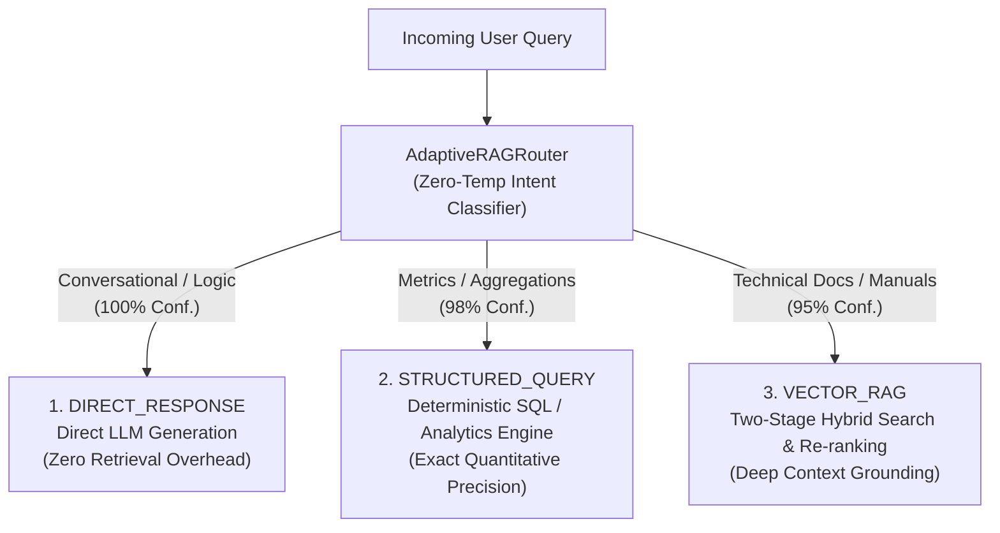

# Module 9: Adaptive Query Routing & Agentic Dispatch 🧭

> *Languages:* [English](#-english) | [Español](#-español)

---

## 🇺🇸 English

### 🎯 Overview & Problem Statement
In naive RAG architectures, **every single user request is blindly pushed through the same heavy retrieval pipeline** (embedding generation $\rightarrow$ vector index lookups $\rightarrow$ cross-encoder re-ranking $\rightarrow$ grounded LLM generation).

This architectural rigidity causes severe production bottlenecks:
- **Wasted Latency & Token Costs**: Simple greetings (`"Hello! How are you?"`) trigger unnecessary vector searches and embedding API calls.
- **Poor Performance on Aggregations**: Questions like `"What were total sales last month?"` fail in vector search because dense semantic vectors cannot compute quantitative mathematical sums across thousands of database rows.
- **Suboptimal User Experience**: Latency spikes on non-technical queries.

**Adaptive Query Routing** introduces an upstream intent classifier that routes requests dynamically to their optimal specialized execution engine.

---

### 🔬 Architecture & Dispatch Workflow



---

### 📊 Latency & Cost Optimization Matrix

| Route Destination | Execution Subsystem | Latency Profile | Token & API Cost | Optimal Use Cases |
|---|---|---|---|---|
| **`DIRECT_RESPONSE`** | Lightweight Generative LLM | $\sim 150 - 300\text{ ms}$ | 🟢 Ultra Low (0 embedding/vector calls) | Greetings, pleasantries, generic reasoning |
| **`STRUCTURED_QUERY`** | Relational SQL / API Engine | $\sim 50 - 150\text{ ms}$ | 🟢 Zero Vector Cost (Deterministic SQL) | Sales totals, user counts, inventory, tabular reports |
| **`VECTOR_RAG`** | Hybrid Search + Cross-Encoder + LLM | $\sim 800 - 1500\text{ ms}$ | 🟡 Standard RAG Cost (Full pipeline) | Architecture manuals, technical documentation, policies |

---

### 🚀 How to Run

```bash
npm run test:09
```

---

## 🇪🇸 Español

### 🎯 Descripción General y Planteamiento del Problema
En arquitecturas RAG ingenuas, **todas las consultas del usuario se envían ciegamente por el mismo pipeline pesado de recuperación** (cálculo de embeddings $\rightarrow$ búsqueda vectorial $\rightarrow$ re-ranking $\rightarrow$ generación con contexto).

Esto genera ineficiencias críticas en producción:
- **Desperdicio de Latencia y Costos**: Saludos simples (`"¡Hola! ¿Cómo estás?"`) disparan búsquedas vectoriales innecesarias.
- **Incapacidad para Consultas Cuantitativas**: Preguntas como `"¿Cuántas ventas totales hubo el último mes?"` fallan en búsqueda vectorial porque los embeddings densos no pueden sumar filas de bases de datos.

El **Enrutamiento Adaptativo de Consultas** analiza la intención del usuario y despacha la petición al motor óptimo:
1. **`DIRECT_RESPONSE`**: Generación directa sin costo de recuperación.
2. **`STRUCTURED_QUERY`**: Ejecución en bases de datos relacionales / SQL determinista.
3. **`VECTOR_RAG`**: Recuperación en dos etapas con contexto técnico anclado.

---

### 🚀 Cómo Ejecutar

```bash
npm run test:09
```
