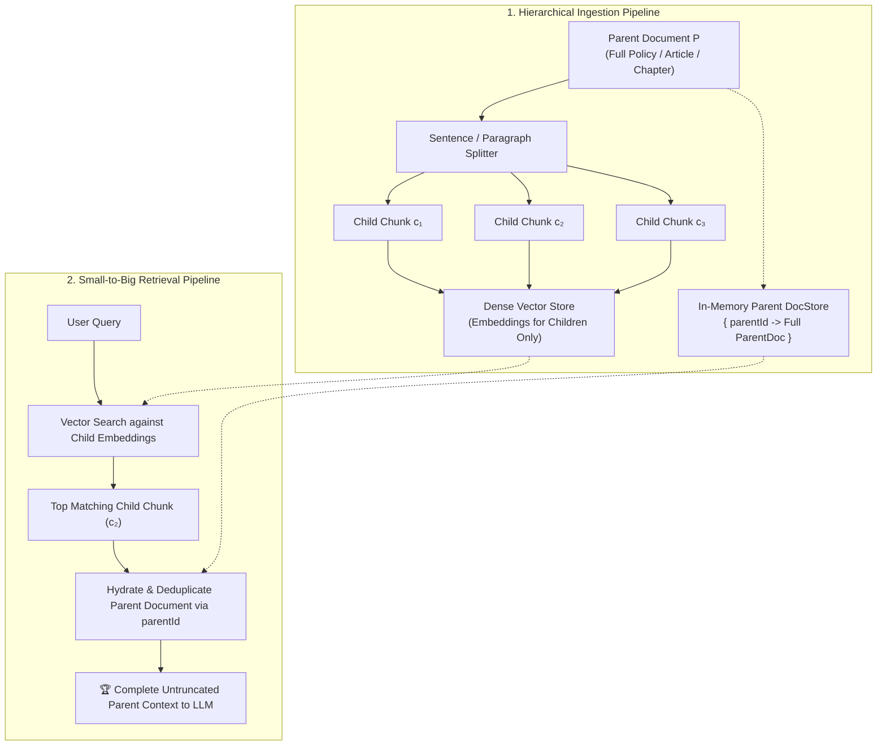

# Module 10: Parent-Document Retrieval & Hierarchical Chunking (Small-to-Big) 🌲

> *Languages:* [English](#-english) | [Español](#-español)

---

## 🇺🇸 English

### 🎯 Overview & The Chunk Size Dilemma
In standard flat chunking architectures, engineers face a fundamental contradiction known as the **Chunk Size Dilemma**:

| Chunk Strategy | Retrieval Quality (Dense Embedding Search) | Generation Quality (LLM Synthesis & Reasoning) |
|---|---|---|
| **Small Chunks** (~50–150 tokens) | 🟢 **High Precision**: Laser-focused vector embedding, zero concept dilution. | 🔴 **Poor Context**: Fragmented ideas, missing antecedent references, lost context. |
| **Large Chunks** (~800–2000 tokens) | 🔴 **Low Precision**: Embedding vector is diluted across multiple topics. | 🟢 **Rich Context**: Full explanations, complete procedures, coherent structure. |

**Parent-Document Retrieval (Small-to-Big)** decouples the retrieval unit from the generation unit:
1. **Index Small**: Subdivide parent documents into fine-grained child chunks (sentences or small paragraphs) and compute dense embeddings *only* for children.
2. **Generate Big**: When a child chunk matches the user query, hydrate and pass the **entire parent document** (or larger parent section) to the generative LLM.

---

### 🔬 Architecture & Workflow



---

### 🚀 How to Run

```bash
npm run test:10
```

---

## 🇪🇸 Español

### 🎯 Descripción General y la Paradoja del Tamaño de Fragmento
En el particionamiento plano tradicional, los ingenieros enfrentan una contradicción fundamental:
- **Fragmentos Pequeños (50–150 tokens)**: Excelente precisión de búsqueda vectorial sin dilución semántica, pero contexto insuficiente para el LLM.
- **Fragmentos Grandes (800–2000 tokens)**: Contexto completo para generar respuestas ricas, pero los vectores se diluyen y reducen la precisión de búsqueda.

La técnica **Parent-Document Retrieval (Small-to-Big)** desacopla la unidad de búsqueda de la unidad de generación:
1. **Buscar con Hijos Pequeños**: Indexa embeddings densos únicamente de fragmentos atómicos (oraciones).
2. **Responder con Padres Completos**: Al encontrar coincidencia en un hijo, hidrata y entrega al LLM el **documento padre íntegro** con todo su contexto circundante.

---

### 🔬 Beneficios Clave en Producción

1. **Cero Dilución Semántica**: Cada vector representa una única idea específica.
2. **Cero Truncamiento de Contexto**: El LLM recibe políticas completas, cláusulas circundantes y procedimientos operativos íntegros.
3. **Deduplicación Automática**: Si múltiples fragmentos hijo del mismo padre coinciden en la búsqueda, el documento padre se incluye una sola vez.

---

### 🚀 Cómo Ejecutar

```bash
npm run test:10
```
