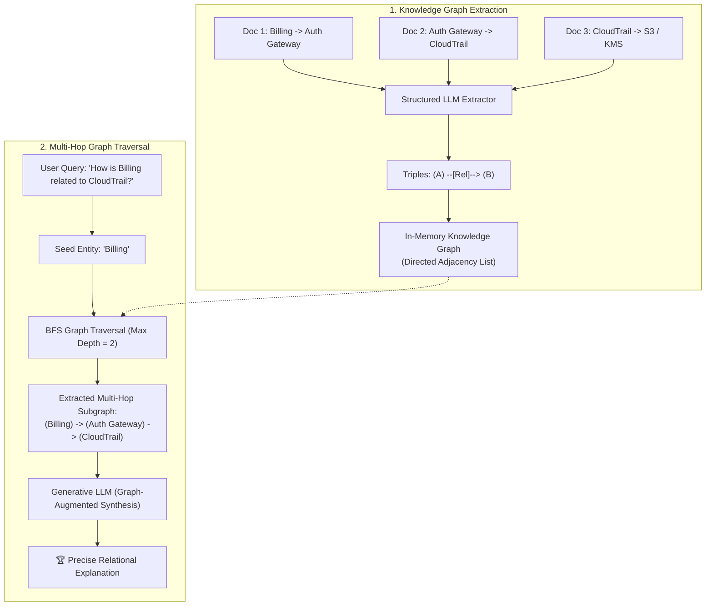

# Module 11: GraphRAG & Entity-Relation Knowledge Extraction 🕸️

> *Languages:* [English](#-english) | [Español](#-español)

---

## 🇺🇸 English

### 🎯 Overview & The Multi-Hop Reasoning Problem
Standard RAG systems rely strictly on flat vector search. While effective for localized queries, **flat vector search fails dramatically on multi-hop questions** requiring cross-document relational reasoning:

#### Why Flat Vectors Fail on Multi-Hop Queries
Consider 3 disjoint documents across a knowledge base:
- **Doc 1**: *"Billing microservice strictly depends on Auth Gateway."*
- **Doc 2**: *"Auth Gateway delegates access auditing to CloudTrail."*
- **Doc 3**: *"CloudTrail stores encrypted logs in an S3 bucket."*

If a user asks: *"How does Billing relate to CloudTrail?"*
- A dense embedding of the query has low cosine similarity to **Doc 1** (which doesn't mention CloudTrail) and low cosine similarity to **Doc 2** (which doesn't mention Billing).
- **Result**: Standard vector search misses the intermediate bridge (`Auth Gateway`) and fails to answer.

#### The Solution: GraphRAG
**GraphRAG** extracts structured entity-relation knowledge triples ($\text{Subject} \xrightarrow{\text{Relation}} \text{Object}$) during ingestion, indexes them in a directed knowledge graph, and performs **Breadth-First Search (BFS) multi-hop traversal** to bridge connections across disparate documents.

---

### 🔬 Architecture & Workflow



---

### 📊 Flat Vector RAG vs. GraphRAG

| Capability | Standard Flat Vector RAG | GraphRAG (Knowledge Graph) |
|---|---|---|
| **Data Representation** | Unstructured dense floating-point arrays | Explicit structured directed triples: $(s, r, t)$ |
| **Multi-Hop Reasoning** | 🔴 Poor (fails when entities span multiple chunks) | 🟢 Excellent (resolves arbitrary $N$-hop graph paths) |
| **Inter-document Bridges** | 🔴 Blind to indirect dependencies | 🟢 Discovers transitive relationships automatically |
| **Explainability** | Opaque cosine similarity scores | Human-verifiable textual evidence per edge |

---

### 🚀 How to Run

```bash
npm run test:11
```

---

## 🇪🇸 Español

### 🎯 Descripción General y el Problema del Razonamiento Multi-Salto
Los sistemas RAG estándar dependen exclusivamente de la búsqueda vectorial plana. Aunque son eficaces para consultas puntuales, **fallan rotundamente en preguntas de múltiples saltos (multi-hop reasoning)** que requieren conectar información fragmentada en distintos documentos:

#### Por qué los Vectores Planos Fallan
- **Doc 1**: *"El microservicio de Facturación depende de Auth Gateway."*
- **Doc 2**: *"El Auth Gateway delega la auditoría en CloudTrail."*

Al preguntar: *"¿Cómo se relaciona Facturación con CloudTrail?"*, la búsqueda vectorial clásica no encuentra coincidencia directa porque el Doc 1 no menciona CloudTrail y el Doc 2 no menciona Facturación.

#### La Solución: GraphRAG
**GraphRAG** extrae ternas estructuradas de conocimiento ($\text{Sujeto} \xrightarrow{\text{Relación}} \text{Objeto}$) en formato JSON, construye un grafo de conocimiento dirigido en memoria y ejecuta **recorridos BFS multi-salto** para conectar entidades a través de múltiples documentos.

---

### 🚀 Cómo Ejecutar

```bash
npm run test:11
```
