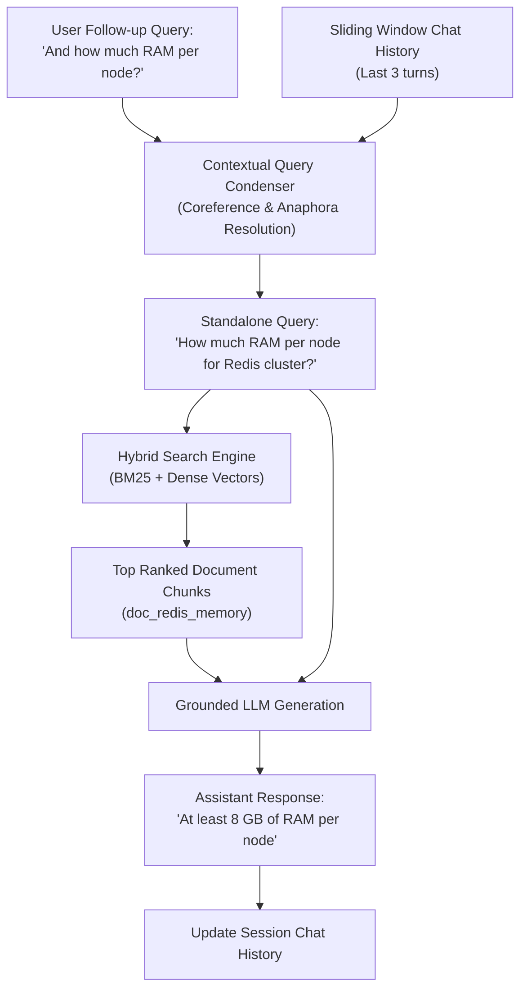

# Module 12: Conversational RAG & Contextual Query Condensation 💬

> *Languages:* [English](#-english) | [Español](#-español)

---

## 🇺🇸 English

### 🎯 Overview & The Chat History Dilution Problem
In conversational AI applications, users communicate iteratively using **pronouns, ellipsis, and context-dependent follow-up questions**:
- *Turn 1*: `"How many master nodes does a Redis cluster require?"` $\rightarrow$ (Answer: 3 nodes)
- *Turn 2*: `"And how much RAM is recommended per node?"`

#### Why Naive Full-History Vectorization Fails (Vector Pollution)
Naive RAG implementations concatenate the entire chat history into the search query:
```
Query = "User: How many master nodes... Assistant: 3 nodes... User: And how much RAM..."
```
- **Vector Dilution**: The embedding vector represents a mixture of disparate topics.
- **Wrong Retrievals**: Keywords from older turns pull irrelevant documents into context.
- **Latency & Cost**: Massive prompt sizes waste tokens and context window budget.

#### The Solution: Upstream Contextual Query Condensation
Before searching the vector store or hybrid index, a dedicated lightweight LLM pass resolves **anaphora and coreferences**, rewriting the follow-up request into a **standalone, self-contained search query**:

$$\text{User Query } q_t + \text{History } \mathcal{H} \xrightarrow{\text{Condensation}} q_{\text{standalone}}$$

$$\text{e.g., } \text{"And how much RAM per node?"} \longrightarrow \text{"How much RAM is recommended per node for a Redis cluster?"}$$

---

### 🔬 Architecture & Workflow



---

### 📊 Naive History Concatenation vs. Query Condensation

| Dimension | Naive Full-History Concatenation | Contextual Query Condensation |
|---|---|---|
| **Retrieval Query** | Bloated text with multiple past topics | Laser-focused single standalone question |
| **Embedding Purity** | 🔴 Low (Diluted across multiple domains) | 🟢 High (Precise intent embedding) |
| **Search Precision** | 🔴 False positives from historical keywords | 🟢 Pinpoint retrieval of relevant chunks |
| **Token Consumption** | 🔴 Exponentially grows with conversation turns | 🟢 Constant bounded search query size |

---

### 🚀 How to Run

```bash
npm run test:12
```

---

## 🇪🇸 Español

### 🎯 Descripción General y el Problema de la Contaminación Vectorial
En asistentes conversacionales, los usuarios formulan preguntas de seguimiento dependientes del contexto usando **pronombres, elipsis y referencias anafóricas**:
- *Turno 1*: `"¿Cuántos nodos maestros necesita un clúster de Redis?"` $\rightarrow$ (Respuesta: 3 nodos)
- *Turno 2*: `"¿Y cuánta memoria RAM se recomienda por nodo?"`

#### Por qué Fallar al Vectorizar el Historial Completo
Concatenar todo el historial conversacional en la búsqueda vectorial genera **dilución y contaminación vectorial**:
- El embedding resultante promedia múltiples temas a la vez.
- Términos de turnos anteriores arrastran fragmentos irrelevantes (ej. documentación de Postgres).

#### La Solución: Condensación Contextual de Consultas
Antes de consultar los índices, un módulo de resolución anafórica reescribe la pregunta ambigua en una **consulta autocontenida**:
- *"¿Y cuánta memoria RAM se recomienda por nodo?"* $\longrightarrow$ *"¿Cuánta memoria RAM se recomienda por nodo para un clúster de Redis?"*

---

### 🚀 Cómo Ejecutar

```bash
npm run test:12
```
