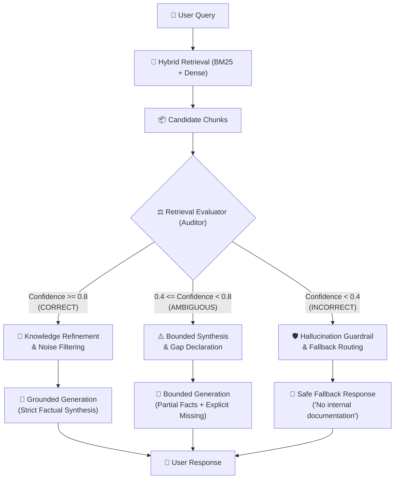

# Module 13: Corrective RAG (CRAG) & Active Self-Correction

> **Production RAG Architectures Series** — Advanced Retrieval Auditing, Confidence-Gated Generation, and Noise-Induced Hallucination Prevention.

---

## 🇺🇸 English

### 📖 Overview
Standard RAG architectures operate under an unverified assumption: that retrieved context chunks are always relevant, factual, and sufficient. In production, vector search engines often return irrelevant noise or out-of-domain chunks when users query unknown topics. Blindly injecting these noisy documents into the generation prompt leads directly to **noise-induced hallucinations**, **syllogistic fallacies**, or **overconfident falsifications**.

**Corrective RAG (CRAG)** (*Yan et al., 2024*) solves this vulnerability by introducing an active **Retrieval Evaluator (Auditor)** between retrieval and generation. CRAG quantifies the factual sufficiency and relevance of retrieved documents into a tri-state confidence score:
1. **`CORRECT`**: The retrieved context directly answers the query. The system refines and extracts only verified facts, eliminating extraneous tokens.
2. **`AMBIGUOUS`**: The context contains partial or incomplete clues. The generator provides a bounded response while explicitly declaring information gaps.
3. **`INCORRECT`**: The context is entirely out-of-domain or irrelevant. The pipeline halts prompt injection immediately, preventing hallucination and routing to a safe fallback or web search.

---

### 🏗️ Architecture & Workflow



---

### 📊 Comparative Analysis

| Feature | Standard RAG | Self-RAG | Corrective RAG (CRAG) |
|---|---|---|---|
| **Retrieval Verification** | ❌ None (Blind injection) | ⚠️ Post-hoc Reflection Tokens | ✅ Dedicated Pre-Generation Audit |
| **Noise Filtering** | ❌ No filtering | ⚠️ Implicit in LLM weights | ✅ Explicit Fact Distillation |
| **Out-of-Domain Safety** | ❌ Severe Hallucination Risk | ⚠️ Variable refusal | ✅ Deterministic Fallback Guardrail |
| **Latency Profile** | ⚡ Fast (Single Call) | ⏳ High (Multi-token reflection) | 🚀 Balanced (Audit + Refined Call) |

---

### 🚀 Execution

Run the CRAG test suite:
```bash
npm run test:13
```

---

## 🇪🇸 Español

### 📖 Descripción General
Las arquitecturas RAG estándar operan bajo una premisa vulnerable: asumen que los fragmentos recuperados son siempre pertinentes, veraces y suficientes. En entornos productivos, los motores vectoriales suelen recuperar ruido irrelevante o fragmentos fuera de dominio cuando los usuarios realizan consultas no contempladas en el corpus. Inyectar ciegamente estos documentos ruidosos al prompt de generación provoca **alucinaciones inducidas por ruido**, **falacias silogísticas** y **respuestas falsas con falso exceso de confianza**.

**Corrective RAG (CRAG)** (*Yan et al., 2024*) resuelve esta fragilidad incorporando un **Evaluador de Recuperación Activo (Auditor)** entre la fase de búsqueda y la de síntesis. CRAG audita cuantitativamente la suficiencia de los documentos en tres estados de confianza:
1. **`CORRECT`**: El contexto responde directamente la consulta. Se destilan los hechos comprobados y se eliminan tokens superfluos.
2. **`AMBIGUOUS`**: El contexto contiene pistas parciales o incompletas. El generador sintetiza lo comprobable y declara explícitamente los vacíos de información.
3. **`INCORRECT`**: El contexto es irrelevante o ajeno al dominio. El pipeline frena en seco la inyección de contexto ruidoso, evitando alucinaciones y activando una respuesta de respaldo segura (*fallback*).

---

### 🧩 Decisiones de Arquitectura
- **Evaluador Estricto**: Clasificador probabilístico que produce estado (`CORRECT`, `AMBIGUOUS`, `INCORRECT`), puntaje de confianza y resumen de conocimiento filtrado (`filteredKnowledge`).
- **Prevención de Alucinación**: Ante una consulta sobre routers Cisco cuando el corpus solo tiene políticas de SLA, CRAG clasifica como `INCORRECT` e impide inyectar políticas de SLA que el LLM intentaría relacionar erróneamente.
- **Bifurcación Dinámica**: Rutas de ejecución optimizadas según la calidad del material recuperado.

---

### 🚀 Ejecución

Ejecuta la suite de pruebas de CRAG:
```bash
npm run test:13
```
