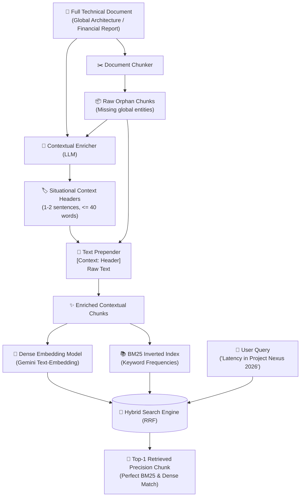

# Module 14: Contextual Retrieval & Chunk Pre-Enrichment

> **Production RAG Architectures Series** — Situational Contextualization, Orphan Chunk Disambiguation, and Hybrid Index Enrichment.

---

## 🇺🇸 English

### 📖 Overview
A fundamental flaw in traditional RAG architectures is the **Orphan Chunk Problem** (Context Stripping). When long documents are segmented into smaller passages (e.g., 200–500 tokens), critical global metadata—such as project codenames, fiscal quarters, company entities, software versions, and overarching themes—resides only in the introduction or preceding sections. 

Consequently, an isolated chunk such as:
> *"Average transaction processing latency decreased by 35% due to Graviton3 adoption and payload compression."*

completely lacks the keywords and semantic signals linking it to **"Project Nexus"** or **"Q3 2026"**. When a user queries *"How much did latency improve in Project Nexus during 2026?"*, both dense vector search and sparse BM25 fail to retrieve this vital chunk.

**Contextual Retrieval** (*Anthropic, 2024*) solves this breakdown by using an LLM to generate a concise, 1–2 sentence situational header for each chunk before indexing. The enriched chunk is then indexed across both dense vector stores and BM25 sparse lexical indices:

$$\text{Enriched Chunk} = \text{"[Context: This chunk discusses Q3 2026 latency metrics for Project Nexus...]"} \oplus \text{Raw Chunk}$$

---

### 🏗️ Architecture & Workflow



---

### 📊 Comparative Analysis

| Dimension | Standard Chunking | Parent Document Retrieval | Contextual Retrieval (CR) |
|---|---|---|---|
| **Storage Overhead** | Minimal ($1\times$) | Medium (Child vectors + Parent store) | Minimal ($1.1\times$ tokens) |
| **BM25 Lexical Matching** | ❌ Fails on missing global entities | ⚠️ Matches parent or child | ✅ Excellent (Exact keywords prepended) |
| **Dense Semantic Vector** | ❌ Diluted / isolated meaning | ⚠️ Child-only embeddings | ✅ Enriched hybrid semantic vector |
| **LLM Context Window Cost** | Minimal | High (Hydrates full parent doc) | Optimized (Returns focused chunk with header) |
| **Ingestion Latency** | ⚡ Real-time | ⚡ Fast | ⏳ Requires batch LLM calls during indexing |

---

### 🚀 Execution

Run the Contextual Retrieval test suite:
```bash
npm run test:14
```

---

## 🇪🇸 Español

### 📖 Descripción General
Una limitación crítica de las arquitecturas RAG convencionales es el **Problema del Fragmento Huérfano** (*Orphan Chunk Problem*). Al dividir documentos extensos en fragmentos pequeños (200–500 tokens), el metacontexto global (nombres de proyectos, trimestres fiscales, entidades empresariales, versiones de software y alcances arquitectónicos) suele ubicarse únicamente en la introducción o secciones previas.

Como resultado, un fragmento huérfano como:
> *"La latencia promedio en el procesamiento de transacciones disminuyó un 35% gracias a la adopción de instancias Graviton3..."*

carece por completo de palabras clave y señales semánticas vinculadas a **"Proyecto Nexus"** o **"Q3 2026"**. Cuando un usuario pregunta *"¿Cuánto mejoró la latencia en el proyecto Nexus durante 2026?"*, tanto la búsqueda vectorial densa como BM25 léxico fallan en recuperar este fragmento indispensable.

**Contextual Retrieval** (*Anthropic, 2024*) resuelve esta descontextualización empleando un LLM para generar una breve cabecera situacional de 1 a 2 oraciones por fragmento antes de la indexación:

$$\text{Fragmento Enriquecido} = \text{"[Contexto: Este fragmento describe métricas de latencia de Q3 2026 para Proyecto Nexus...]"} \oplus \text{Texto Crudo}$$

---

### 🧩 Beneficios de la Arquitectura
1. **Doble Cobertura Híbrida**: BM25 indexa de forma natural las palabras clave globales inyectadas en la cabecera, mientras que el modelo de embeddings genera un vector denso posicionado en el espacio semántico exacto de la entidad global.
2. **Eficiencia en Inferencia**: A diferencia de Parent-Document Retrieval que envía el documento padre completo al LLM de generación, Contextual Retrieval envía únicamente el fragmento focalizado con su cabecera sintetizada.

---

### 🚀 Ejecución

Ejecuta la suite de pruebas de Contextual Retrieval:
```bash
npm run test:14
```
