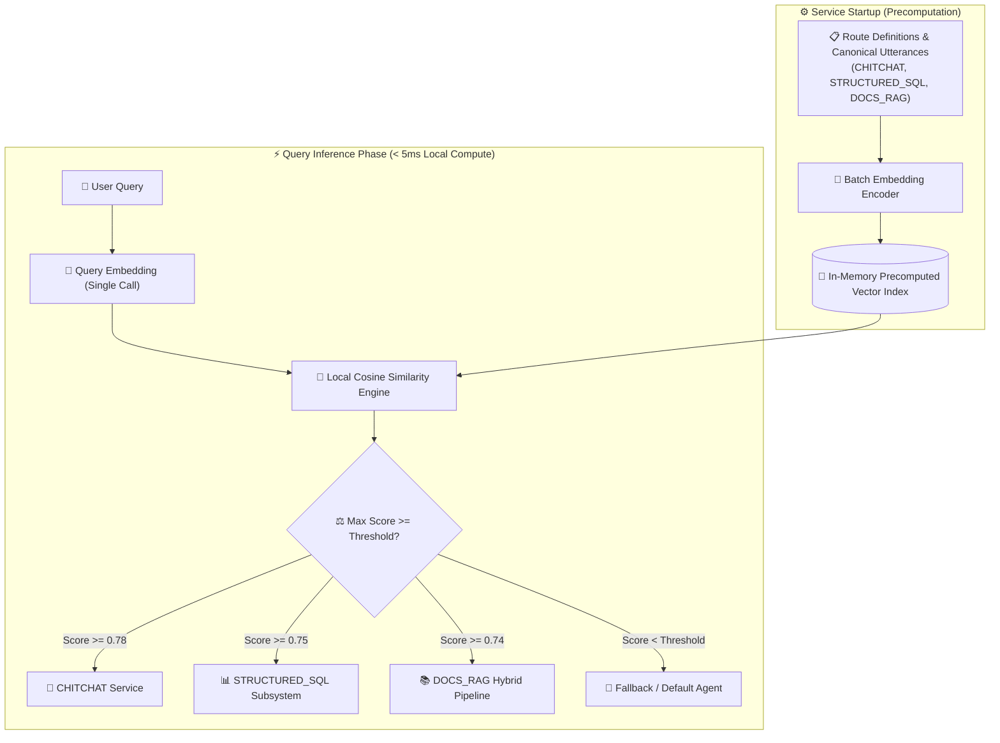

# Module 15: High-Throughput Semantic Router (Non-LLM Intent Classification)

> **Production RAG Architectures Series** — Embedding-Based Intent Dispatch, Sub-Millisecond Local Vector Comparison, and Zero-LLM Routing.

---

## 🇺🇸 English

### 📖 Overview
In production RAG systems, routing user queries to the appropriate subsystem (e.g., ChitChat, SQL analytics, Technical Documentation RAG, or Live APIs) is often implemented using a generative LLM prompt. While flexible, **LLM-based routing introduces severe production bottlenecks**:
1. **High Latency Penalty**: A generative LLM round-trip adds 800ms–2500ms before retrieval even begins.
2. **High Token & Monetary Cost**: Millions of routing prompts consume significant LLM context and quota.
3. **Fragile Output Parsing**: Non-deterministic JSON outputs occasionally fail schema validation.

**Embedding-Based Semantic Routing** (*Aurelio AI / Semantic Router pattern*) eliminates these bottlenecks by precomputing dense vector embeddings for canonical route utterances during service bootstrap. When an incoming query arrives, only a single fast embedding is calculated, and local cosine similarity across all precomputed candidate vectors is performed in **$< 1\text{ ms}$**:

$$\text{Best Route} = \arg\max_{R_i} \left( \max_{v \in R_i} \cos(\mathbf{e}_{\text{query}}, \mathbf{v}) \right) \quad \text{subject to} \quad \text{Score} \ge \tau_{R_i}$$

If no route exceeds its configured confidence threshold $\tau$, the router safely dispatches to the default fallback path without risking hallucinations.

---

### 🏗️ Architecture & Workflow



---

### 📊 Comparative Benchmark

| Metric | Regex / Keyword Router | LLM-as-a-Dispatcher | Embedding Semantic Router |
|---|---|---|---|
| **Routing Latency** | ⚡ $< 1\text{ ms}$ | ⏳ $800\text{–}2500\text{ ms}$ | 🚀 Fast Embedding + $< 1\text{ ms}$ local math |
| **Semantic Flexibility** | ❌ None (Brittle exact matches) | ✅ High (Full natural language) | ✅ High (Dense vector abstraction) |
| **Cost per 1M Queries** | 💲 $0.00 | 💲💲💲 \$20.00–\$150.00 | 💲 \$0.10 (Embedding only) |
| **Output Determinism** | 🔒 100% Deterministic | ⚠️ Variable JSON formatting | 🔒 100% Deterministic |
| **Out-of-Domain Safety** | ❌ Fails on typos | ⚠️ Hallucination risk | ✅ Precise threshold gate & fallback |

---

### 🚀 Execution

Run the Semantic Router test suite:
```bash
npm run test:15
```

---

## 🇪🇸 Español

### 📖 Descripción General
En sistemas RAG productivos, el enrutamiento de consultas hacia subsistemas especializados (ChitChat conversacional, análisis SQL sobre bases de datos relacionales, RAG de documentación técnica o APIs de terceros) suele implementarse mediante un prompt a un LLM generativo. Aunque flexible, **el enrutamiento basado en LLMs impone graves cuellos de botella**:
1. **Penalización de Latencia**: Añade entre 800ms y 2500ms de tiempo de respuesta antes de iniciar la recuperación.
2. **Costo de Tokens Innecesario**: Millones de consultas de clasificación consumen cuotas elevadas de LLM.
3. **Parseo Frágil**: Respuestas no deterministas con errores ocasionales de sintaxis JSON.

El **Enrutador Semántico Basado en Embeddings** (*patrón Semantic Router*) elimina estos problemas precalculando los vectores de frases canónicas (*utterances*) durante el arranque del servicio. Al recibir una consulta, solo se genera un embedding y se calculan similitudes de coseno en memoria local en **menos de $1\text{ ms}$**:

$$\text{Ruta Elegida} = \arg\max_{R_i} \left( \max_{v \in R_i} \cos(\mathbf{e}_{\text{query}}, \mathbf{v}) \right) \quad \text{si} \quad \text{Score} \ge \tau_{R_i}$$

Si ninguna ruta supera su umbral $\tau$, el sistema despacha a la ruta de *fallback* de manera determinista y sin riesgo de alucinaciones.

---

### 🧩 Decisiones de Arquitectura
- **Precomputación en Boot**: Los embeddings de todas las frases canónicas se generan una sola vez al inicializar el servicio.
- **Evaluación No Generativa**: Sin llamadas de generación de texto en el camino crítico.
- **Umbrales Configurables**: Cada intención cuenta con su propio umbral de confianza calibrado ($\tau_{\text{CHITCHAT}}=0.78$, $\tau_{\text{SQL}}=0.75$, $\tau_{\text{RAG}}=0.74$).

---

### 🚀 Ejecución

Ejecuta la suite de pruebas del Enrutador Semántico:
```bash
npm run test:15
```
